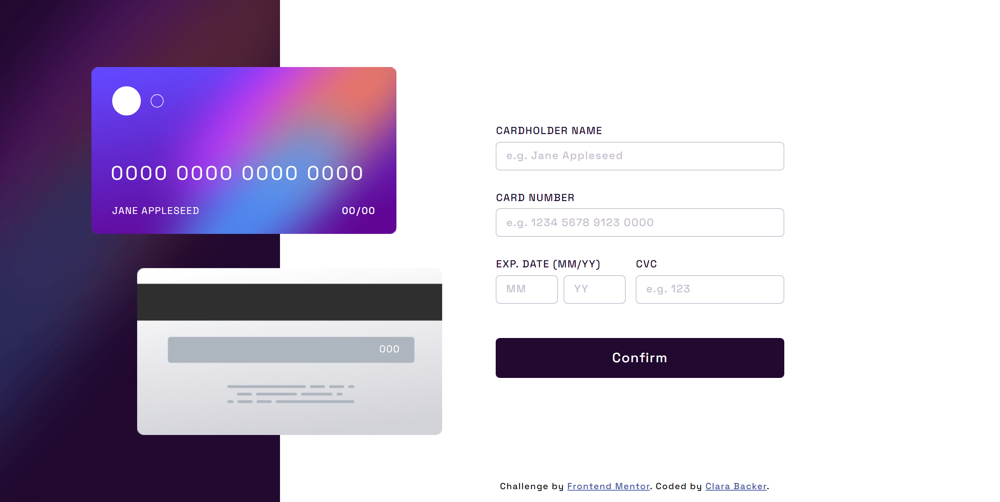
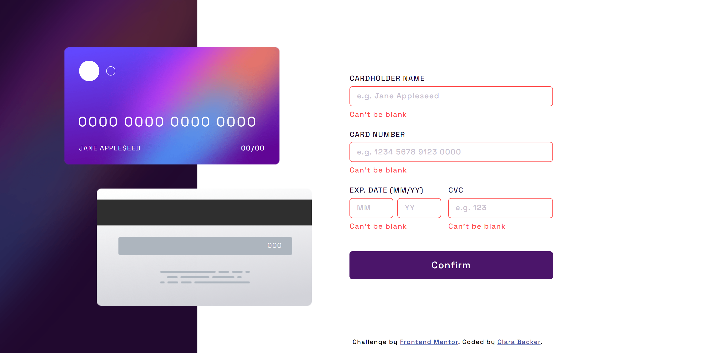
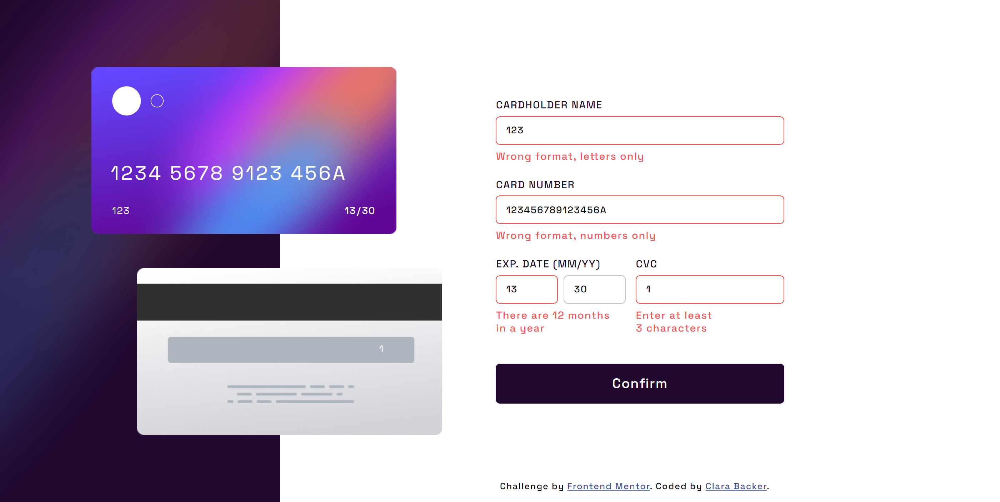
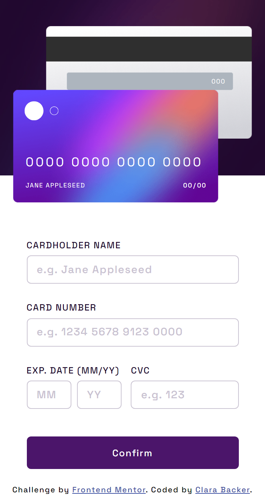
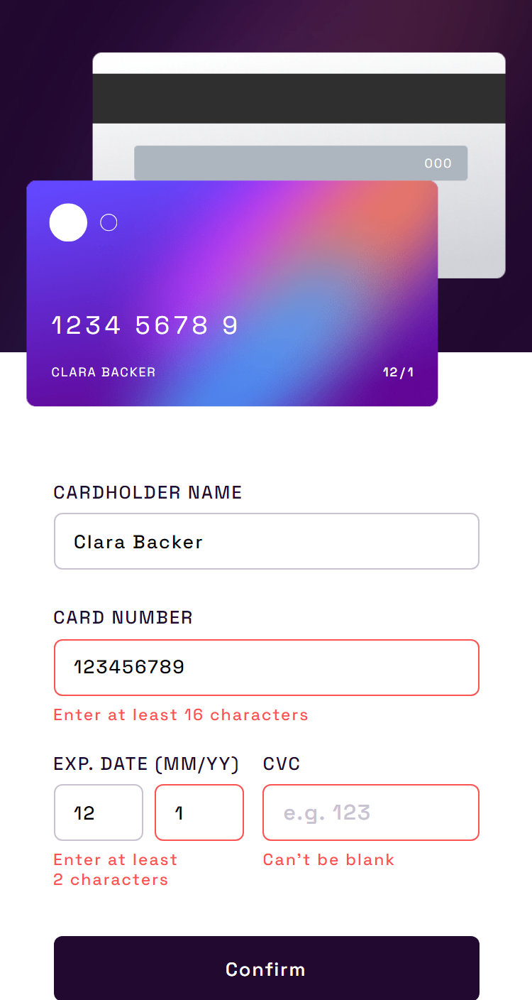

# Frontend Mentor - Interactive card details form solution

This is a solution to the [Interactive card details form challenge on Frontend Mentor](https://www.frontendmentor.io/challenges/interactive-card-details-form-XpS8cKZDWw). Frontend Mentor challenges help you improve your coding skills by building realistic projects. 

#### [*You can see the result by clicking here.*](https://clarabacker.github.io/interactive-card-details-form/)

## Table of contents

- [Overview](#overview)
  - [The challenge](#the-challenge)
    [Expected behavior](#expected-behavior)
  - [Screenshots](#screenshots)
- [My process](#my-process)
  - [Built with](#built-with)
  - [What I learned](#what-i-learned)
- [Author](#author)
- [License](#license)

## Overview

### The challenge

Users should be able to:
- Fill in the form and see the card details update in real-time
- Receive error messages when the form is submitted if:
  - Any input field is empty
  - The card number, expiry date, or CVC fields are in the wrong format
- View the optimal layout depending on their device's screen size
- See hover, active, and focus states for interactive elements on the page

### Expected behavior

- Update the details on the card as the user fills in the fields
- Validate the form fields when the form is submitted
- If there are no errors, display the completed state
- Reset the form when the user clicks "Continue" on the completed state

<br>

### Screenshots

&nbsp;&nbsp;&nbsp;&nbsp;&nbsp; - Desktop View:
<p align="center">
    
</p>

&nbsp;&nbsp;&nbsp;&nbsp;&nbsp; - User can't submit when invalid input:
<p align="center">
    
</p>

&nbsp;&nbsp;&nbsp;&nbsp;&nbsp; - Error shown when invalid input; Input fields remain active state if inputs are valid:
<p align="center">
  
</p>

&nbsp;&nbsp;&nbsp;&nbsp;&nbsp; - Complete state:
<p align="center">
  
</p>

&nbsp;&nbsp;&nbsp;&nbsp;&nbsp; - Mobile View
<p>
    &nbsp;&nbsp;&nbsp;
    &nbsp;&nbsp;&nbsp;
  
</p>

<br>

## My process

### Built with:

- Semantic HTML5 markup
- CSS custom properties
- Flexbox
- CSS Grid
- JavaScript
- Mobile-first workflow

### What I learned:
 - Form validation using Javascript
 - Styling CSS gradient border
 ```css
    .input:active, .input:focus {
      background: linear-gradient(#fff, #fff) padding-box, linear-gradient(to right,rgb(100, 72, 254), rgb(96, 5, 148)) border-box;
      border: 1px solid transparent;
      border-radius: 6px;
    }
```

## Author

- Github - [Clara Backer](https://github.com/clarabacker)
- Frontend Mentor - [@clarabacker](https://www.frontendmentor.io/profile/clarabacker)

## License

This project is licensed under the MIT License. See the LICENSE file for more information.